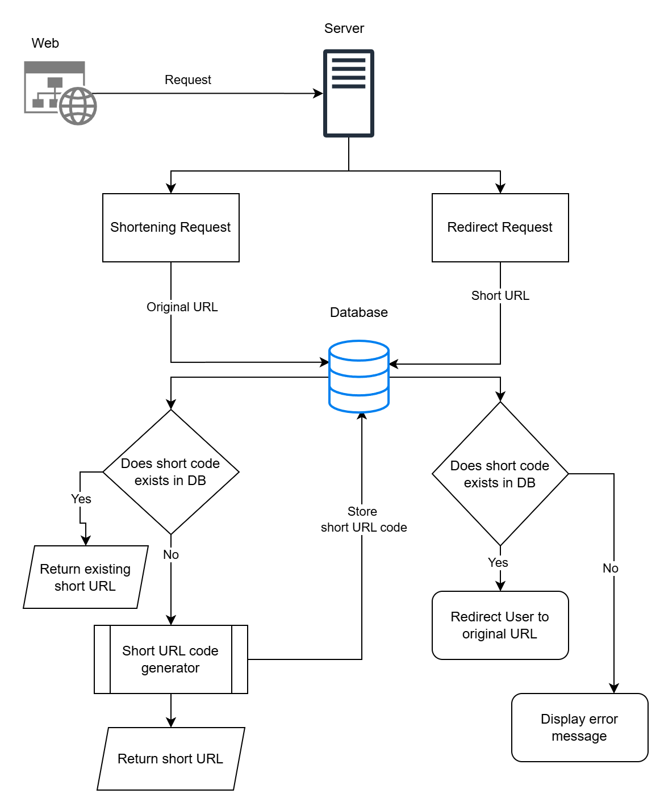
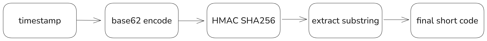

# 🔗 TinyUrl

[](https://turbo.build/repo)
[](https://react.dev/)
[](https://www.typescriptlang.org/)
[](https://tailwindcss.com/)
[](https://nodejs.org/)
[](https://expressjs.com/)
[](https://www.mongodb.com/)
[](./LICENSE)

---

A simple yet modern **URL Shortener** built with the MongoDB, Express.js, React, Node.js and TypeScript.  
TinyUrl allows users to shorten long links, manage them through an authenticated dashboard, and view detailed analytics, all wrapped in a clean and minimal UI.

<div align="center" style="display: flex; justify-content: center;">
<figure >
  <picture>
    <source media="(prefers-color-scheme: dark)" srcset="assets/diagrams/hld-dark.png" />
    <source media="(prefers-color-scheme: light)" srcset="assets/diagrams/hld-light.png" />
    
  </picture>
  <figcaption><p>High Level Design</p></figcaption>
</figure>
</div>

## Screenshots

<div align="center" style="display: flex; justify-content: center;">
  <figure>
  
  </figure>  
  
</div>

## How It Works

TinyUrl takes a **long, complex URL** and generates a **short, unique code** using a random string generator stored in MongoDB.  
Each short link is associated with its original URL, metadata, and analytics records.

When a user visits a short link:

1. The backend looks up the short code in MongoDB.
2. The original long URL is retrieved.
3. A click log is added (IP address, timestamp).
4. The user is redirected to the destination instantly.

All user actions (creating, editing, deleting, tracking URLs) are protected by **JWT-based authentication** ensuring secure and isolated data per user.

### Short URL Generation Logic

This is the fun part, the little “brain” behind TinyUrl.  
I wanted to have a bit _chaotic_ logic, and this chaoticness makes logic unpridictable, irreversable.

So here’s what actually happens under the hood:

<div style="width : 650px; margin: auto; display: flex; justify-content: center; align-items: center;">
<figure >
  <picture>
    <source media="(prefers-color-scheme: dark)" srcset="assets/diagrams/flow-dark.png" />
    <source media="(prefers-color-scheme: light)" srcset="assets/diagrams/flow-light.png" />
    
  </picture>
</figure>
</div>

1. **A seed number** is created using the current timestamp
   specifically `Date.now() % 10000`.

   > Why modulo 10000? Because we only need a small, ever-changing seed.  
   > The clock does half the randomness for us.

2. This seed is then converted into a **Base62 string**:

   Base62 is generated from the characters: "0123456789ABCDEFGHIJKLMNOPQRSTUVWXYZabcdefghijklmnopqrstuvwxyz"

   > Why not base64 ? Because base64 includes **+** and **/** , they messup when placed in a URL.

3. Instead of directly using that Base62 value, it’s passed through an **HMAC-SHA256** hashing process using a secret key.

- This step makes each output **non-predictable**.
- Even if two users generate URLs at the same second, the HMAC ensures a unique twist.
- Also… adding cryptography just felt _coool_.

4. From the resulting hash, I extract a **substring from the middle** ,
   because, well, why not make the logic slightly mysterious?  
   It’s a deliberate design choice to make reverse-engineering the pattern _nearly impossible_. 😎
5. Finally, that substring becomes the short code: **xYz12**

Each short code is unique enough for small-scale use, unpredictable to humans, and a fun playground for experimenting with crypto-based randomness.

## Features

- **Authentication**
  - Secure registration and login with JWT.
  - Access tokens stored safely in `localStorage`.
  - Protected routes on both client and server.

- **URL Management**
  - Create, edit, and delete short URLs.
  - Add titles and descriptions for better organization.
  - Copy short URLs in one click.
  - Generate QR codes automatically for easy sharing.

- **Analytics**
  - Track total click counts for each short URL.
  - Log each visit with timestamp and IP.
  - View analytics directly in the dashboard.

- **UI & UX**
  - Built with **React + TailwindCSS**.
  - Responsive layout for all screen sizes.
  - Toast notifications for instant feedback.
  - Minimal and distraction-free design.

## Tech Stack

### Backend

- Node.js + Express
- MongoDB (Mongoose)
- JWT Authentication
- CORS, dotenv for configuration

### Frontend

- React (TypeScript)
- TailwindCSS
- React Router
- Axios
- React-QR-Code
- Vite for fast builds

## Setup & Run

### Prerequisites

- Node.js (>= 18)
- MongoDB (Local or Atlas)

### Clone the Repo

```bash
git clone https://github.com/<your-username>/tinyurl.git
cd tiny-url
```

### Install Dependencies

```bash
npm install
```

### Run the App

```
npm run dev
```

### Using Docker for MongoDB

```
cd tiny-url
docker-compose up -d
```

### License

MIT License © 2025 Gadangi Sainag ☺️
